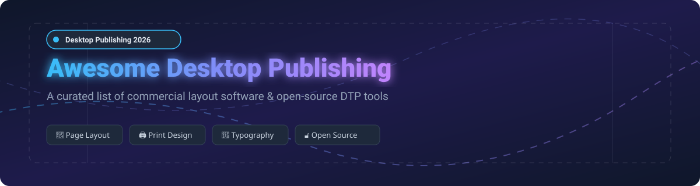

# Awesome Desktop Publishing Software 🖨️✨

  
  
  
  

**Curated List of Commercial Layout Software & Open-Source GitHub Desktop Publishing (DTP) Projects**

*Focused on Page Layout, Print Design, Editorial Workflows, Typography & Digital Publishing*

**Last updated: October 2026** 📅

---

Welcome to the ultimate curated directory of **Desktop Publishing (DTP) software**, **page layout engines**, and **open-source typesetting tools**. Whether you are a professional graphic designer, editorial publisher, marketer, or developer building layout systems, this guide provides detailed insights into commercial tools and production-grade open-source GitHub repositories.

---

## 📖 Table of Contents

- [💼 Commercial Tools & SaaS Products](#-commercial-tools--saas-products)
- [🔓 Open-Source GitHub Projects](#-open-source-github-projects)
- [🤝 How to Contribute](#-how-to-contribute)
- [⚠️ Disclaimer](#-disclaimer)
- [⭐ Star History](#-star-history)
- [💖 Support & Sponsorship](#-support--sponsorship)

---

## 💼 Commercial Tools & SaaS Products

> **📊 Market Context & Industry Dynamics**: The global Desktop Publishing (DTP) & digital layout software market is estimated at **~$4.5 Billion** and is **moderately fragmented**. Industry-standard tools like **Adobe InDesign** dominate enterprise printing and editorial workflows (**$20.99–$22.99/month**), while **QuarkXPress** caters to traditional publishing houses (**$314/year** subscription or **$637** perpetual). Perpetual-license disruptors like **Affinity Publisher** (**$29.79** one-time) and browser-based template platforms like **Canva** (**$14.99/user/month** or free tier) capture significant web-first market share. No single vendor holds a total winner-take-all monopoly, allowing specialized tools to thrive across niche workflows.

### 🏢 Commercial Software & SaaS Comparison Table

Sorted by parent company size (Revenue / Market Valuation) in descending order:

| Tool | Description | Pricing (Starting Tier) | Free Tier Limits / Trial | Company Size (Revenue / Valuation) |
|------|-------------|------------------------|--------------------------|-----------------------------------|
| **[Microsoft Publisher](https://www.microsoft.com/en-us/microsoft-365/publisher)** 📑 | **SMB-friendly layout tool.** Simplified page layout, templates, and mail merge. *Discontinued from future Office releases.* | **$200.00** (Office Professional 2021 perpetual edition) | **No standalone free tier** (Excluded from Office 2024; 30-day M365 trial available for legacy version) | **~$281 Billion Revenue** *(Microsoft FY2025)* |
| **[Adobe InDesign](https://www.adobe.com/products/indesign.html)** 🎨 | **The industry-standard page layout tool.** Precision typography, master pages, threaded text frames, IDML interchange, and print-ready PDF export. | **$22.99/month** (single app) or **$20.99/month** (Creative Cloud All Apps annual) | **7-day fully functional free trial** (Requires Creative Cloud account; no perpetual free plan) | **~$21.5 Billion Revenue** *(Adobe FY2025)* |
| **[Canva](https://www.canva.com/)** 🪄 | **The design & drag-and-drop platform for everyone.** 5M+ templates, 140M+ assets, AI Magic tools, social planner, and print-on-demand. | **$14.99/user/month** (Canva Pro annual) or **$15.00/month** (monthly) | **Free forever plan**: Core design tools, 5GB cloud storage, 1M+ free assets & templates | **~$40 Billion Valuation** *(Private est. 2024)* |
| **[Affinity Publisher](https://affinity.serif.com/en-us/publisher/)** 📐 | **Professional page layout at a one-time price.** Clean UI, StudioLink integration with Affinity Photo/Designer, IDML import. | **$29.79** one-time purchase (no subscription required) | **No free tier** (Provides a 30-day money-back guarantee & 7-day free trial) | **Part of Canva** *(Acquired 2024, ~$40B valuation)* |
| **[VistaCreate Pro](https://create.vista.com/)** 🖼️ | **Vistaprint's web design & publishing platform.** Templates, animation tools, and direct print integration. | **$10.00/month** (Pro plan for up to 10 team seats) | **Free starter plan**: 100K+ templates, 1GB storage, basic design assets | **Part of Cimpress** *(Vistaprint parent, ~$3.8B Revenue)* |
| **[QuarkXPress](https://www.quark.com/)** 📰 | **The original DTP pioneer.** High-power long document layout, editorial automation, and digital publishing tools. | **$314.00/year** (Prepaid subscription) or **$637.00** (Perpetual license + 1-yr M&S) | **7-day full evaluation trial** (No perpetual free plan) | **Private company** *(Quark Software Inc.)* |
| **[Marq](https://www.marq.com/)** 🏢 | **Brand templating platform (formerly Lucidpress).** Template locking, multi-channel marketing automation, and brand compliance. | **$12.00/user/month** (Pro plan) or custom enterprise pricing | **Free tier**: 25 MB cloud storage, 3 active project limit, basic template access | **Private company** *(Marq Inc.)* |
| **[Swift Publisher 5](https://apps.apple.com/us/app/swift-publisher-5/id1058362543)** 🍏 | **Mac-exclusive desktop publishing app.** Custom layout templates, 2D/3D heading generators, booklet printing output. | **$19.99** one-time purchase on Mac App Store | **Free trial download** (Watermarked export output on free trial version) | **Private company** *(BeLight Software)* |

---

## 🔓 Open-Source GitHub Projects

The open-source DTP and page layout ecosystem ranges from full graphical desktop applications to cutting-edge programmable typesetting engines.

Repositories below are sorted by **GitHub Stars_Count** in descending order.

| Repo | Description | GitHub_Stars |
|------|-------------|-------|
| **[LaTeX](https://github.com/latex3/latex2e)** 📄 | **Document preparation & typesetting system.** The gold standard for high-quality structured document layout, complex mathematical typesetting, and academic publishing. **LPPL-1.3c**. |  |
| **[Typst](https://github.com/typst/typst)** ⚡ | **Markup-based typesetting system built in Rust.** Designed to be as powerful as LaTeX while being easier to learn and fast (instant live preview). Features flexible layout grids and modern visual styling. **Apache-2.0**. |  |
| **[Inkscape](https://github.com/inkscape/inkscape)** 🎨 | **Professional vector graphics editor.** Excellent for single-page layout, illustrations, vector design, SVG editing, and typography placement. **GPL-3.0**. |  |
| **[LibreOffice Draw](https://github.com/LibreOffice/core)** 📦 | **Vector graphics & page layout engine.** Part of the LibreOffice suite. Supports multi-page document layout, diagramming, booklet arrangement, and PDF editing. **MPL-2.0**. |  |
| **[Scribus](https://github.com/scribusproject/scribus)** 🖨️ | **The premier open-source desktop publishing application.** XML-based file format, master pages, CMYK color management, spot colors, micro-typography, and professional PDF/X export. **GPL-2.0**. |  |
| **[WeasyPrint](https://github.com/Kourea/WeasyPrint)** 🌐 | **Visual rendering engine for HTML/CSS to PDF.** Converts web documents with Paged Media CSS specifications into print-ready layouts, books, and reports. **BSD-3-Clause**. |  |
| **[DesignCraft](https://github.com/storytold/designcraft)** 🦀 | **Clean-room reimplementation of Adobe InDesign in pure Rust.** Features Knuth–Plass paragraph composer, baseline grids, IDML import/export, WebAssembly browser runner, and MCP server for AI layout agents. **MIT**. |  |

---

## 🤝 How to Contribute

Contributions are always welcome! 🚀

1. **Fork** the repository.
2. **Create a branch** for your feature or additions (`git checkout -b add-dtp-tool`).
3. Add the project to `README.md` keeping formatting consistent (sorted appropriately).
4. Submit a **Pull Request** with a brief summary of the software or repo added.

---

## ⚠️ Disclaimer

- This directory is **community-curated** for educational and research purposes.
- **Microsoft Publisher Notice**: Discontinued and excluded from Office 2024. Office 2021 perpetual is the final release.
- **Commercial vs Open-Source**: While open-source tools like **Scribus**, **Typst**, and **DesignCraft** offer great autonomy and power, commercial software (**InDesign**, **QuarkXPress**) provides deep prepress color matching, extensive typography features, and industry-standard commercial print handoff formats.

---

## ⭐ Star History

---

## 💖 Support & Sponsorship

Thank you for exploring and supporting the **Awesome Desktop Publishing Software** project! ⭐

If you find this repository helpful for your design workflows or open-source research, please consider:
- 🌟 **Starring** this repository on GitHub.
- 🔀 **Forking** and contributing new layout software and tools.
- 📢 **Sharing** this curated list with designers, developers, and tech communities.

☕ **Buy me a coffee / Sponsor**: If you'd like to support ongoing open-source curation and development, check out the [GitHub Sponsor Dashboard](https://github.com/sponsors/ishandutta2007). Your support is greatly appreciated! 🙌
